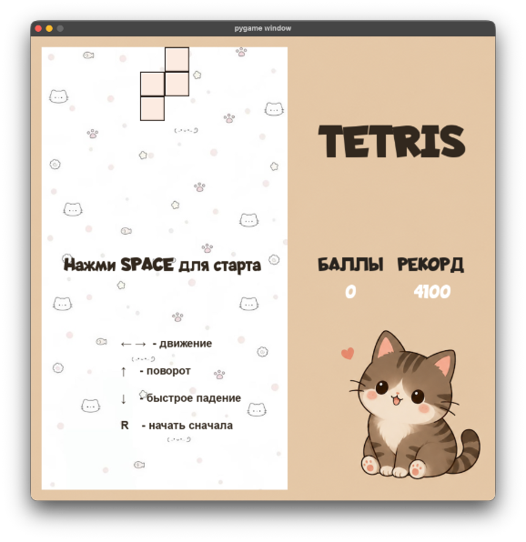
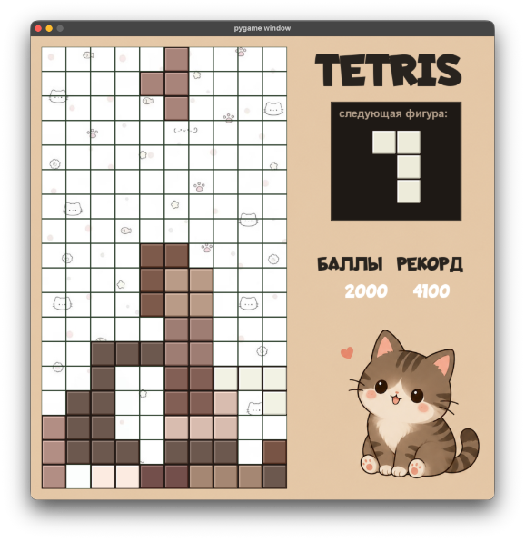
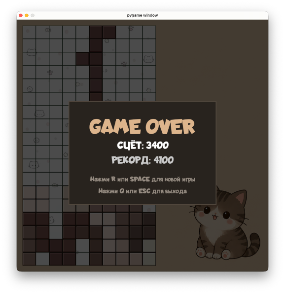

# 🐱 Cat Tetris

Минималистичная игра «Тетрис» с авторским кошачьим оформлением, разработанная на языке **Python** с использованием библиотеки **Pygame**.

Проект выполнен в рамках учебной работы по дисциплине «Учебная практика».

---

## 📖 Описание проекта

Cat Tetris представляет собой классическую игру «Тетрис», в которой игрок управляет падающими фигурами и должен заполнять горизонтальные линии игрового поля. После заполнения линии она удаляется, а игрок получает очки.

Особенностью проекта является минималистичный дизайн в кошачьем стиле, а также наличие визуальных эффектов, системы рекордов и удобного пользовательского интерфейса.

---

## ✨ Основные возможности

- Классическая механика игры «Тетрис»
- Случайная генерация фигур
- Отображение следующей фигуры
- Подсчёт очков
- Сохранение рекордного результата
- Режим паузы
- Экран завершения игры (Game Over)
- Визуальные эффекты частиц при удалении линий
- Минималистичный интерфейс в едином стиле

---

## 🎮 Управление

| Клавиша | Действие |
|----------|-----------|
| ← | Перемещение фигуры влево |
| → | Перемещение фигуры вправо |
| ↑ | Поворот фигуры |
| ↓ | Ускоренное падение |
| SPACE | Пауза / продолжение игры |
| R | Перезапуск игры |
| Q | Выход из игры (на экране Game Over) |

---

## 🖼 Скриншоты

### Стартовый экран



### Игровой процесс



### Экран завершения игры



---

## 🎥 Демонстрация работы

Видео с демонстрацией механики игры:

https://rutube.ru/video/private/0b61d8c9e35c0d11a8784e3dbbe2fa1c/?p=g0OBNrHl-bBQx0br9Di8Gg

---

## 🛠 Используемые технологии

- Python 3.x
- Pygame
- Git
- GitHub

---

## ⚙ Установка и запуск

### 1. Клонирование репозитория

```bash
git clone https://github.com/USERNAME/Cat-Tetris.git
cd Cat-Tetris
```

### 2. Установка зависимостей

```bash
pip install pygame
```

или

```bash
pip install -r requirements.txt
```

### 3. Запуск игры

```bash
python index.py
```

---

## 🏆 Система рекордов

Игра автоматически сохраняет максимальный результат игрока в файл `record.txt`.

При следующем запуске программы рекорд загружается и отображается в интерфейсе.

---

## 🧪 Тестирование

В ходе разработки были протестированы следующие компоненты:

- перемещение фигур;
- поворот фигур;
- обработка столкновений;
- удаление заполненных линий;
- начисление очков;
- работа режима паузы;
- сохранение рекордов;
- экран завершения игры;
- перезапуск игрового процесса.

По результатам тестирования критических ошибок обнаружено не было.
